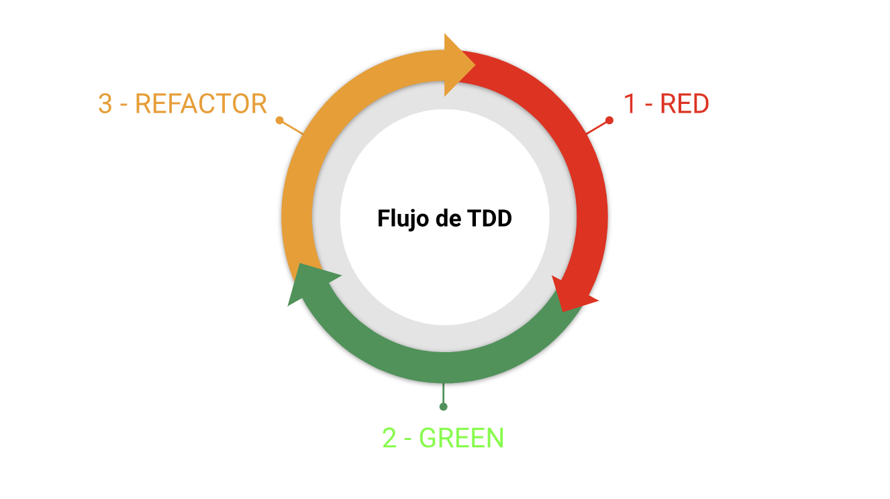

# Test Driven Development en ReactJS

Test Driven Development (TDD) o desarrollo dirigido por pruebas es una técnica para desarrollar software que consiste en ciclos cortos de código en los que primero escribes una prueba automatizada que falle, después se hace lo mínimo necesario para que pase y finalmente la refactorización.

**Instalación para Vite**

`pnpm add -D jest babel-jest @babel/preset-env @babel/preset-react`

**Configuración de `babel.config.json`**

```json
{
  "presets": [
    ["@babel/preset-env", { "targets": { "esmodules": true } }],
    ["@babel/preset-react", { "runtime": "automatic" }]
  ]
}
```

### Ciclo TTD



- **Red**: crear una prueba automatizada que falle
- **Green**: hacer lo mínimo necesario para que la prueba pase
- **Refactor**: aplicar técnicas de refactorización y buenas prácticas en el código

## Testing Library

**Instalación para Vite**

`pnpm add -D @testing-library/dom @testing-library/react jest-environment-jsdom @testing-library/jest-dom`

**Configuración de `jest.config.js`**

```js
export default {
  testEnvironment: 'jest-environment-jsdom'
}
```

### Diccionario

- `describe`: agrupador de test
- `test`: permite ejecutar un test (también se puede llamar `it`)
- `mock`: objeto simulado que imita el comportamiento de objetos reales, permitiendo probar y validar partes específicas
- `render`: renderizar un componente de React en un contenedor DOM
- `screen`: nos permite acceder a los elementos del renderizado (todos aquellas queries que comiencen con `findBy` devuelve una promesa y son utilizados para test asincrónicos)
- `fireEvent`: permite disparar eventos del DOM
  - `user-event`: librería que permite englobal múltiples eventos de fireEvent para ejecutarlos a la misma vez `pnpm add @testing-library/user-event`
- `waitFor`: esperar a que ciertas condiciones se cumplan en pruebas asíncronicas

**_Créditos_**

👉 [https://www.udemy.com/course/tdd-react-js/](https://www.udemy.com/course/tdd-react-js/)  
👉 [https://developero.io/blog/test-driven-development](https://developero.io/blog/test-driven-development)  
👉 Configuración de Jest + TS en Vite: [https://medium.com/@vitor.vicen.te/setting-up-jest-js-for-a-vite-ts-js-react-project-the-ultimate-guide-7816f4c8b738](https://medium.com/@vitor.vicen.te/setting-up-jest-js-for-a-vite-ts-js-react-project-the-ultimate-guide-7816f4c8b738)
