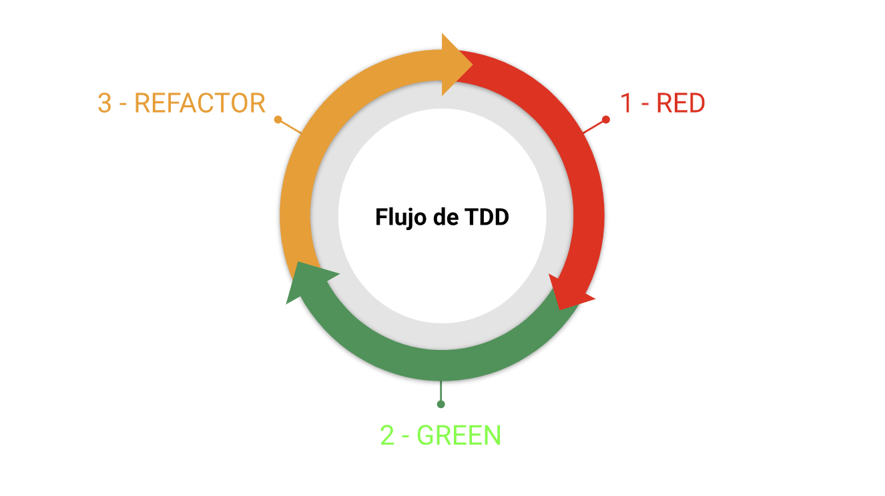

# Test Driven Development en ReactJS

Test Driven Development (TDD) o desarrollo dirigido por pruebas es una técnica para desarrollar software que consiste en ciclos cortos de código en los que primero escribes una prueba automatizada que falle, después se hace lo mínimo necesario para que pase y finalmente la refactorización.

**Ciclo TTD**

- **Red**: crear una prueba automatizada que falle
- **Green**: hacer lo mínimo necesario para que la prueba pase
- **Refactor**: aplicar técnicas de refactorización y buenas prácticas en el código

**Diccionario**

- `describe`: agrupador de test
- `test`: permite ejecutar un test (también se puede llamar `it`)
- `mock`: objeto simulado que imita el comportamiento de objetos reales, permitiendo probar y validar partes específicas

**_Créditos_**

👉 [https://www.udemy.com/course/tdd-react-js/](https://www.udemy.com/course/tdd-react-js/)  
👉 [https://developero.io/blog/test-driven-development](https://developero.io/blog/test-driven-development)
